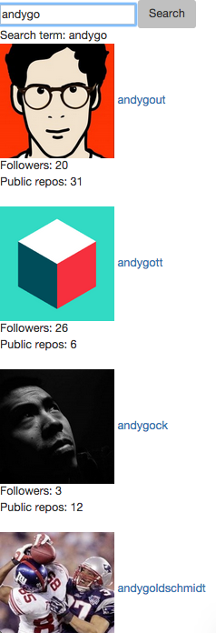
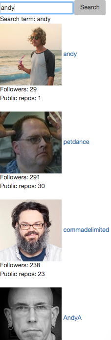

[](https://travis-ci.org/andygout/github_profiles) [](https://codeclimate.com/github/andygout/github_profiles)


GitHub Profiles
=================


Brief:
-------

Create a simple GitHub Profile app purely in JavaScript that grabs data from the GitHub API in order to display a specified users avatar, number of followers and number of repos.


Live demo on Heroku
-------

[Github Profiles](https://mighty-forest-5249.herokuapp.com)


Technologies used:
-------

- [AngularJS](https://docs.angularjs.org/guide/introduction) (In software development, AngularJS (commonly referred to as "Angular") is an open-source web application framework maintained by Google and by a community of individual developers and corporations to address many of the challenges encountered in developing single-page applications. It aims to simplify both the development and the testing of such applications by providing a framework for client-side model–view–controller (MVC) architecture, along with components commonly used in rich Internet applications)
- Tested using [Karma](http://karma-runner.github.io/0.13/index.html) (a JavaScript test-runner built with Node.js, and meant for unit testing)
- E2E (end-to-end) tested using [Protractor](http://angular.github.io/protractor) (end-to-end test framework for AngularJS applications; runs tests against your application running in a real browser, interacting with it as a user would; a Node.js programme) using a [Selenium Server](http://www.seleniumhq.org/) (automates browsers)


Site setup:
-------

#### [npm](https://docs.npmjs.com/cli/init) / [package.json](https://docs.nodejitsu.com/articles/getting-started/npm/what-is-the-file-package-json)

- Install Node (if not already): `$ brew install node`
- Create `package.json` with `$ npm init` (return for all); gives info to npm to identify project and handle its dependencies
- `node_modules` directory is created when first node package is installed, i.e.: `$ npm install jasmine-node --save-dev` (`--save-dev` switch adds node package directory in `node_modules` directory and lists it in `package.json` file as a development-only dependency; removing `-dev` would list simply as a dependency)
- Add `node_modules` folder to `.gitignore` file
- If pulling project from separate repo, run `$ npm install` from root (*a la* `bundle` for a Ruby project)
- Ensure okay and check for version number: `$ node -v`


#### [Bower](http://bower.io/)

- Package manager similar to npm but optimized for front-end; can be used in conjunction with Sinatra, Node or Rails to manage front-end dependencies
- Install bower (if not already): `$ npm install -g bower` (made global with `-g` switch)
- Ensure okay and check for version number: `$ bower -v`
- In project directory `$ npm install --save-dev bower`
- Create `bower.json` with `$ bower init` (return for all)
- `bower_components` directory is created when first package is installed, i.e.: `$ bower install jquery --save` (`--save` switch adds package directory in `bower_components` directory and lists it in `bower.json` file as a dependency; `--save-dev` would list it as a development-only dependency)
- Add `bower_components` folder to `.gitignore` file
- If pulling project from separate repo, run `$ bower install` from root (*a la* `bundle` for a Ruby project)


#### Packages

- `$ bower install jquery --save`
- `$ bower install bootstrap --save`
- `$ bower install angular --save`
- `$ bower install angular-resource --save`


#### Access Token

- Acquire a [GitHub access token](https://github.com/settings/tokens) (click 'Generate new token')
- Create new file in root directory called `accessToken.js` and include access token here: `var accessToken = 'xxxxxxxxxxxxxxxxxxxxxxxxxxxxxxxxxxxxxxxx';`


#### Run site (not on server)

- `$ open index.html`


Testing setup - Karma:
-------

#### Test environment

- `$ bower install angular-mocks --save-dev`
- `$ bower install angular-route --save-dev`


#### [Karma](http://karma-runner.github.io/0.13/index.html)

- `$ npm install karma --save-dev`
- `$ npm install karma-jasmine karma-chrome-launcher karma-phantomjs-launcher --save-dev`
- `$ npm install -g karma-cli`
- Create file: `test/karma.conf.js` with [contents](https://github.com/andygout/github_profiles/blob/master/test/karma.conf.js) as per this codebase


#### Run tests

- `$ karma start test/karma.conf.js`


Testing setup - Protractor:
-------

#### Test environment

- Install Node (if not already): `$ brew install node` and check it is > v0.10.0 using `$ node -v`
- Ensure [Java Development Kit (JDK)](http://www.oracle.com/technetwork/java/javase/downloads/index.html) is installed (required to run Selenium Server); check by running `java -version`.


#### [Protractor](http://angular.github.io/protractor)

- Install Protractor globally (if not already): `$ npm install -g protractor` and ensure installation with `$ protractor -v`
- Download binaries: `$ webdriver-manager update`
- Run server: `$ webdriver-manager start` (and view server status info at: [http://localhost:4444/wd/hub](http://localhost:4444/wd/hub)) (*must be running whilst running Protractor tests*)
- Add development dependencies within project: `$ npm install --save-dev protractor`
- Create server for app: `$ npm install --save http-server`; then `$ npm install http-server -g` (if not already installed)
- Run server: `$ http-server`  (*must be running whilst running Protractor tests*)


#### Specifying browser for tests (will default to Google Chrome)

- `test/e2e/conf.js`
- To run on Firefox:

```js
exports.config = {
  seleniumAddress: 'http://localhost:4444/wd/hub',
  specs: ['githubProfileFeature.js'],
  capabilities: {
    browserName: 'firefox'
  }
}
```

- To run on both Firefox and Chrome:
```js
exports.config = {
  seleniumAddress: 'http://localhost:4444/wd/hub',
  specs: ['githubProfileFeature.js'],
  multiCapabilities: [{
    browserName: 'firefox'
  }, {
    browserName: 'chrome'
  }]
}
```


#### Run tests

- `$ webdriver-manager start`
- `$ http-server` *or* `$ node server.js` (Express server) *or* `$ ruby server.rb` / `$ rackup` (Sinatra server)
- `$ protractor test/e2e/conf.js`


Running site on [Express](http://expressjs.com/) server:
-------

- `$ npm install express --save`
- Save Express in the dependencies list in `package.json`: `"express": "^4.13.3"`
- Create `server.js` file in root directory with [contents](https://github.com/andygout/github_profiles/blob/master/server.js) as per this codebase
- Create new folder `public` in root and relocate `js`, `style` and `bower_components` directories into it (ensure `karma.conf.js` file amends routes for `bower_components` accordingly and create `.bowerrc` in root with following content: `{"directory" : "public/bower_components"}`)
- `test/e2e/toDoListFeature.js` will need to change port from 8080 to that required by Express: 3000
- `package.json` file: "scripts": "start" will now need `node server.js`
- NB: Running site without a server will no longer work once local server has been established
- Run server: `$ node server.js`
- View site at: [http://localhost:3000](http://localhost:3000)


Running site on [Sinatra](http://www.sinatrarb.com/) server:
-------

- Create `Gemfile` file in root directory:

````ruby
source 'https://rubygems.org'

gem 'sinatra'
````

- Install gem: `$ bundle`

- Create `server.rb` file in root directory:

````ruby
require 'sinatra'

get '/' do
  send_file 'index.html'
end

set :public_folder, 'public'
````

- Create `config.ru` file in root directory:

````ruby
require './server'

run Sinatra::Application
````

- `test/e2e/githubProfileFeature.js` will need to change port from 8080 to that required by Sinatra: 9292 or 4567 (depending on which method below is used)
- Run server with Rackup: `$ rackup` (view site at: [http://localhost:9292](http://localhost:9292))
- Or Rackup via specific port (to be consistent with Sinatra default port): `$ rackup -p 4567` (view site at: [http://localhost:4567](http://localhost:4567))
- Or with Sinatra `$ ruby server.rb` (view site at: [http://localhost:4567](http://localhost:4567))


Deploying to [Heroku](https://devcenter.heroku.com/articles/git)
-------

- `$ heroku create`
- `$ git push heroku master`


Next steps:
-------

- Consider how to keep accessToken referenced as Heroku [config variable](https://devcenter.heroku.com/articles/config-vars): [Stack Overflow: How to access local ENV variables in angular js](http://stackoverflow.com/questions/21115893/how-to-access-local-env-variables-in-angular-js) / [Frontliners-API](https://github.com/ptolemybarnes/frontliners-api) by [Ptolemy Barnes](https://github.com/ptolemybarnes) - suggests making API call directly from server rather than being sent back to client and made from there (where they will have access to it)


Links:
-------

[GitHub - Makers Academy: GitHub Profiles (Further JavaScript)](https://github.com/makersacademy/course/blob/master/further_javascript/further_javascript.md)

[AngularJS: Official tutorial (PhoneCat Tutorial App)](https://docs.angularjs.org/tutorial)

[AngularJS: 10,000 word tutorial](https://docs.angularjs.org/tutorial)

[Protractor: Official tutorial](http://angular.github.io/protractor/#/tutorial)

[Protractor: Locators](http://angular.github.io/protractor/#/locators) (for targeting DOM elements)

[Protractor: ElementArrayFinder](http://angular.github.io/protractor/#/api?view=ElementArrayFinder) (has methods `each`, `map`, `filter` and `reduce` which are analogous to JavaScript Array methods)

[Protractor: Table of Contents](http://angular.github.io/protractor/#/toc) (Setup/Tests/Reference)

[Protractor: referenceConf.js](https://github.com/angular/protractor/blob/master/docs/referenceConf.js) (re. options for test/e2e/conf.js)

[Express: Getting Started - Installing](http://expressjs.com/starter/installing.html)

[Stack Overflow: Heroku + node.js error (Web process failed to bind to $PORT within 60 seconds of launch)](http://stackoverflow.com/questions/15693192/heroku-node-js-error-web-process-failed-to-bind-to-port-within-60-seconds-of) (changes required in `server.js` to allow Heroku to assign app its own specified port, rather than one listed)


Images:
-------

#### Search for: 'andygout'


#### Search for: 'andygo'


#### Search for: 'andy'
